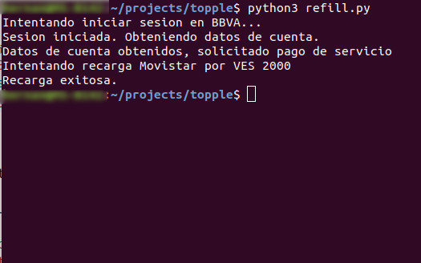
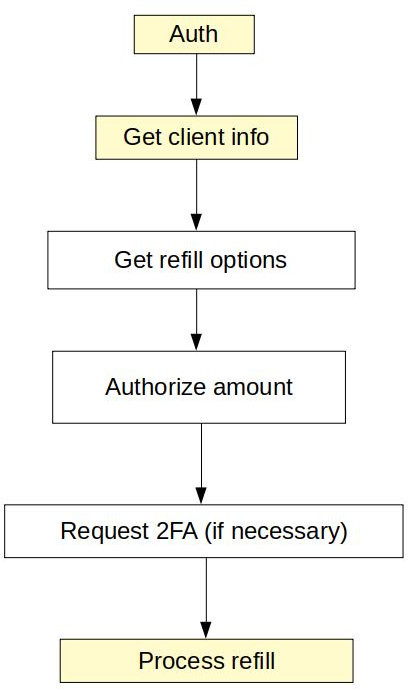

Automated refills for movistar
============================

Mostly a proof of concept

Using BBVA Pronvincial's API

A few caveats:

- The number must be already added to the account's "Frequent operations" otherwise it will require 2FA, and that's not supported (yet?)

# How the bank handles refills
This is what the process looks like when a user does a refill using the bank app

The boxes highlighted are the ones implemented in this script

# Usage
Note this uses python3

Install dependencies with `pip3 install-r requirements.txt`

1. Rename `.secrets.dist` to `.secrets`
2. Fill the details listed in there
3. Run `python3 refill.py`
4. enjoy